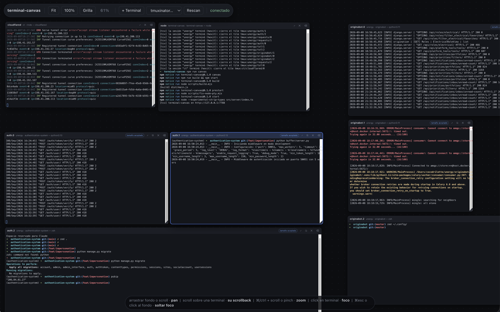

# terminal-canvas

Un lienzo infinito con pan/zoom donde cada pane de tmux es un tile que puedes
mover, redimensionar y usar. Pensado para entornos de tmuxinator con muchas
windows y panes, donde `Ctrl+b s` y navegar hasta el pane correcto se vuelve el
cuello de botella.



## Uso

```bash
npm install          # una sola vez
npm run canvas       # build + servidor, abre el navegador
```

El servidor queda en `http://127.0.0.1:7788` (`TCV_PORT` para cambiarlo).
Descubre lo que ya esté corriendo en tmux — no arranca nada por su cuenta, así que
no duplica servidores ni pelea por los puertos.

| Gesto | Acción |
|---|---|
| arrastrar el fondo, o scroll de dos dedos sobre el fondo | pan |
| scroll sobre una terminal | mover su scrollback (el canvas se queda quieto) |
| ⌘/ctrl + scroll, o pinch en trackpad | zoom (centrado en el cursor) |
| click en una terminal | darle el foco y el teclado |
| ⌘esc, o click en el fondo | soltar el foco |
| arrastrar la barra de título | mover el tile |
| esquina inferior derecha | redimensionar (ajusta cols/rows reales del pane) |
| ⌘0 / ⌘1 / ⌘G | encajar todo / zoom 100% / reempaquetar |
| ⌘T / ⌘R | terminal nueva / re-escanear tmux |
| arrastrar o pegar una imagen sobre una terminal | escribir su ruta en el prompt |

Botones de cada tile: `⤢` zoom a esa terminal, `⧉` sacar el pane a su propia
window para desacoplar su tamaño, `✕` quitar del canvas (el proceso sigue vivo),
`⌫` matar el pane y sus procesos.

El layout (posición y cámara) se guarda en
`~/.config/terminal-canvas/layout.json` y se restaura al abrir.

### Imágenes

Arrastrar una imagen sobre una terminal —o pegarla con ⌘V teniéndola en el
portapapeles— escribe su **ruta absoluta** en el prompt, que es exactamente lo
que produce una terminal nativa cuando le sueltas un archivo. Así Claude Code,
un editor u `open` la leen sin más. No se manda Enter: la ruta queda escrita
para que termines de redactar alrededor.

El navegador solo entrega bytes, nunca una ruta local utilizable, así que la
imagen sube al servidor y aterriza en `~/.config/terminal-canvas/images/`.
Son datos de paso: se borran solas a los 7 días. Formatos: PNG, JPEG, GIF,
WebP, AVIF, BMP, TIFF, HEIC y SVG, hasta 25 MB.

## Como app instalada

El canvas se instala como PWA: ventana propia, ícono en el Dock, ⌘Tab como una
app aparte y sin barra de direcciones. Es el mismo Chrome y el mismo renderer
que la pestaña, así que no cuesta nada de rendimiento.

```bash
npm run autostart    # LaunchAgent: mantiene el servidor vivo y lo arranca al login
```

Después abre `http://127.0.0.1:7788` en Chrome e instálala con el ícono de la
barra de direcciones (o ⋮ → *Enviar, compartir y más* → *Instalar página como
app*). `npm run autostart:off` lo desinstala y `npm run autostart:status` dice
qué opina launchd; los logs quedan en `~/Library/Logs/terminal-canvas.log`.

El agente congela la ruta del node actual: si cambias de versión con nvm, vuelve
a correr `npm run autostart`. Y como deja el puerto tomado, `npm run canvas` ya
no falla: ve que hay un servidor y abre el navegador contra ese. Al revés
también — el agente espera a que sueltes el puerto y lo retoma en segundos.

Dos cosas que la ventana PWA no te da: Chrome se queda con ⌘W (cierra) y con su
menú de recarga, así que si algún atajo no llega a la app, el menú `⋯` tiene los
mismos comandos. Y el service worker cachea sólo el shell (network-first, para
que `npm run dev` no te sirva el `main.js` de ayer): si el servidor no está, la
ventana abre igual pero sin tiles.

Los íconos se regeneran con `npm run icons` (dibuja un SVG con el chromium de
playwright y escribe `assets/icons/*.png`, que sí se versionan).

## Cómo funciona

- **Un tile = un pane, vía control mode.** El servidor abre un cliente
  `tmux -C attach` por *sesión* (no por tile), y ese cliente recibe el `%output`
  de todos los panes de la sesión, incluidos los de windows inactivas. Un tile es
  solo una ruta: pane id → navegador.
- **El canvas no es dueño de nada en tmux.** No crea sesiones; sus clientes de
  control son clientes, así que no aparecen en tu lista de sesiones y no
  sostienen ninguna window. Si destruyes una sesión (`tmuxinator stop`,
  `kill-session`), su cliente sale y los tiles mueren con ella — exactamente
  como tmux lo haría sin el canvas. Esto es una regla, no un detalle: la versión
  anterior usaba una *grouped session* por tile y esas referencias mantuvieron
  vivos procesos de una sesión ya destruida, que se quedaron con sus puertos.
- **El tamaño lo manda tmux, y se dice la verdad.** El canvas pone
  `window-size manual` en las windows que muestra y las dimensiona él. Un pane
  solo en su window recibe el tamaño exacto que pides. Los panes que comparten
  una window se reparten un mismo rectángulo, así que ahí el tile pide, el
  servidor aplica lo que tmux permite y responde con la geometría **real**; el
  tile se ajusta a esa respuesta en vez de mostrar un tamaño que no tiene. El
  badge *tamaño acoplado* marca esos panes, y `⧉` es la salida: los saca a su
  propia window.
- **Abrir no reordena; arrastrar sí.** Al abrir, un tile solo puede *agrandar*
  su window. Si no, tres tiles de la misma window reclamarían la altura completa
  por turnos y se estrujarían entre ellos hasta una fila. Un arrastre explícito
  sí mueve la división, como en tmux, y si deja a un hermano por debajo de tres
  filas el servidor lo rescata al piso mínimo.
- **Los procesos no viven en el canvas.** Viven en tmux. Puedes cerrar el
  navegador o matar el servidor y todo sigue corriendo; al volver, los tiles se
  reconectan y se repintan con `capture-pane`.
- **El scroll tiene un solo dueño a la vez.** Un scroll sobre una terminal es
  para su scrollback, no para la cámara. xterm marca el evento como consumido
  (`preventDefault`) pero lo deja burbujear, así que el canvas también paneaba y
  el texto que estabas leyendo se iba de debajo; ahora respeta esa marca. Además
  el gesto queda enganchado a esa terminal 250 ms, para que llegar al final del
  scrollback a media inercia no le entregue el resto del movimiento al canvas.
- **Zoom nítido.** Se usa el renderer DOM de xterm, no WebGL: el texto es texto
  real y el navegador lo re-rasteriza al escalar, así que se ve nítido en
  cualquier nivel de zoom (y no gasta un contexto WebGL por tile).
- **Nivel de detalle.** Por debajo del 55% de zoom los tiles sin foco dejan de
  renderizar el terminal vivo y muestran un snapshot de texto, refrescado cada
  1.5 s. Eso es lo que mantiene fluido el zoom-out con una docena de terminales
  escupiendo logs.

## Estructura

```
src/server/index.ts    servidor HTTP + WebSocket, rutas pane → navegador
src/server/control.ts  cliente de tmux control mode (protocolo de líneas)
src/server/tmux.ts     descubrimiento, dimensionado y ciclo de vida
src/server/store.ts    layout persistido y proyectos de tmuxinator
src/server/uploads.ts  imágenes soltadas/pegadas, guardadas en disco
src/client/viewport.ts cámara pan/zoom (una sola CSS transform)
src/client/tile.ts     tile: xterm, drag, resize, snapshot, drop de imágenes
src/client/images.ts   subida de imágenes y la ruta que se teclea
src/client/metrics.ts  medición del tamaño de celda
src/client/sw.js       service worker de la PWA (shell cacheado, network-first)
src/client/manifest.webmanifest
                       manifiesto de la PWA
src/shared/protocol.ts protocolo del WebSocket
```

## Pruebas

```bash
npm run canvas                      # en una terminal
PORT=7788 node scripts/ctl-e2e.mjs  # transporte, tamaños y ciclo de vida
SP=/tmp PORT=7788 node scripts/ui-check.mjs   # navegador headless, capturas en $SP
```

`ctl-e2e.mjs` levanta una sesión desechable y verifica, entre otras cosas, que
matar la sesión base se lleve tiles y procesos, que no se cree ninguna sesión
extra, y que un arrastre enorme no deje a un pane hermano en una fila.

## Notas de implementación

- `scripts/fix-node-pty.mjs` (postinstall) le devuelve el bit de ejecución al
  binario `spawn-helper` de node-pty. Ya no se usa node-pty para los tiles, pero
  si npm bloquea los install scripts de las dependencias el binario queda en 644
  y cualquier PTY falla con `posix_spawnp failed`.
- El `%output` de control mode escapa los bytes de control como `\ooo` octal y
  deja pasar UTF-8 crudo, así que el desescapado trabaja sobre bytes: decodificar
  primero rompería un carácter multibyte partido entre dos mensajes.
- El tamaño de celda se mide desde el DOM (`.xterm-screen` ÷ cols/rows) y no de
  `dimensions.css.cell`: el build publicado de xterm mangla sus propiedades
  privadas. Además se mide con la transform del mundo neutralizada, o el factor
  de zoom se filtra en la medición.
- El servidor corre TypeScript directo con `--experimental-strip-types`, que no
  soporta *parameter properties* en constructores; por eso `control.ts` asigna
  sus campos a mano.
- tmux reemplaza por `_` el separador de campos (`\x1f`) de sus formatos `-F`
  cuando el entorno no tiene locale UTF-8. Bajo launchd eso dejaba la discovery
  en basura y el canvas vacío, así que el LaunchAgent exporta `LANG` y la
  discovery descarta las líneas que no traen todos los campos, avisando en vez
  de inventar tiles.
- Con `TCV_WAIT_PORT=1` (lo que pone el LaunchAgent) el servidor espera a que
  se libere el puerto en vez de morir: bajo launchd, morir sólo consigue un
  bucle de reinicios. En primer plano hace lo contrario — avisa de que ya hay un
  servidor y abre el navegador contra ese.
- `client_control_mode` distingue los clientes del canvas de tus terminales, para
  no avisarte de un conflicto de tamaño consigo mismo.
